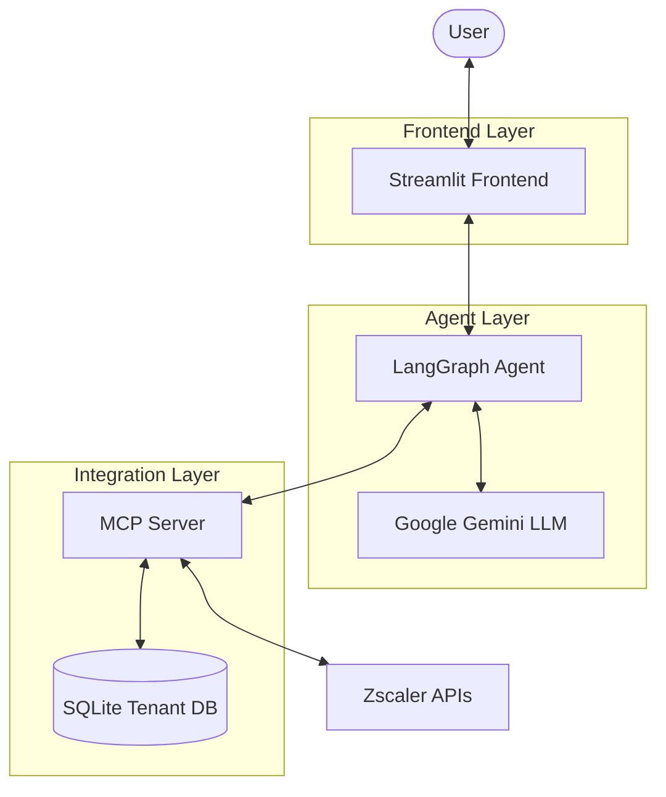
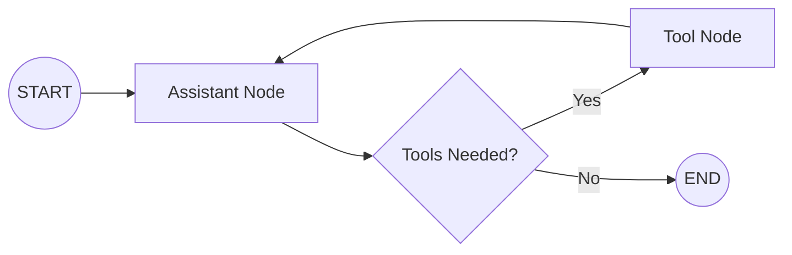
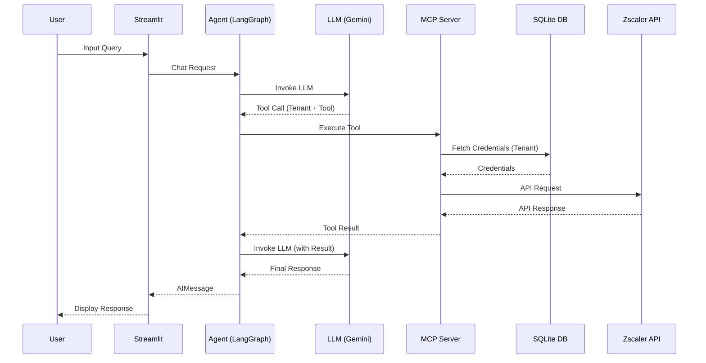

# Zscaler Manager Architecture

## Introduction
Zscaler Manager is a multi-tenant application designed to manage Zscaler environments and provide an AI-powered assistant for security insights. It leverages a modern stack including Streamlit for the frontend, LangGraph for agent orchestration, and the Model Context Protocol (MCP) for dynamic tool integration.

## System Overview
The following diagram illustrates the high-level architecture and component interactions:

## Core Components

### 1. Frontend (Streamlit) - `app.py`
The frontend provides two main views:
- **Tenant Manager**: A CRUD interface for managing Zscaler tenant credentials (Client ID, Secret, etc.) stored in the local SQLite database.
- **Chat**: A conversational interface where users can interact with the Zscaler AI Assistant.

### 2. Agent Orchestration (LangGraph) - `llm_agent.py`
The AI Assistant is built using LangGraph, which manages the stateful interaction between the LLM and various tools.
- It uses a **StateGraph** to define the flow: `START -> assistant -> tools -> assistant`.
- **Memory**: Utilizes `MemorySaver` for thread-persistent conversation history.
- **Tools**: Dynamically loaded from the MCP server using `langchain-mcp-adapters`.

#### Agent State Graph

### 3. Model Context Protocol (MCP) Server - `mcp_server/`
The application uses an MCP server to expose Zscaler capabilities as tools for the LLM.
- **Dynamic Credentials**: The server does not store credentials. Instead, tools fetch credentials from the SQLite database at runtime based on the tenant specified in the user's request.
- **FastMCP**: Built using the `FastMCP` framework for efficient tool and resource registration.
- **Services**: Modularized into services like `ZIA`, `ZPA`, `ZCC`, and `ZIdentity`, each managing its own set of tools.

### 4. Database & Tenant Management - `zsTenantDB.py` & `tenants.db`
- **SQLModel**: Uses SQLModel (on top of SQLAlchemy) for easy interaction with the SQLite database.
- **Schema**: Stores `tenantName`, `clientId`, `clientSecret`, `vanityDomain`, and `customerId`.

### 5. Zscaler API Integration - `mcp_server/utils.py`
Uses the `zscaler` SDK (or `ZscalerClient` wrapper) to interact with Zscaler's REST APIs. It supports multi-tenancy by instantiating clients with specific tenant configurations on demand.

## Data Flow
1. **User Input**: The user sends a query via the Streamlit chat interface (e.g., "List all firewall rules for CorpProd").
2. **Agent Processing**: The LangGraph agent receives the message and sends it to the Gemini LLM.
3. **Tool Selection**: The LLM determines it needs to call a tool (e.g., `zia_list_cloud_firewall_rules`) and identifies the tenant (`CorpProd`).
4. **Tool Execution**: The agent calls the tool via the MCP server.
5. **Credential Fetching**: The MCP tool helper fetches the credentials for `CorpProd` from `tenants.db`.
6. **API Call**: The MCP server uses the credentials to call the Zscaler API and retrieves the data.
7. **Response Generation**: The data is returned to the agent, and the LLM formats the final response (e.g., a markdown table) for the user.

### Data Flow Sequence

## Technology Stack
- **Frontend**: Streamlit
- **Agent Framework**: LangGraph, LangChain
- **LLM**: Google Gemini (via `langchain-google-genai`)
- **Integration**: Model Context Protocol (MCP), FastMCP
- **Database**: SQLite, SQLModel
- **API Client**: Zscaler SDK
